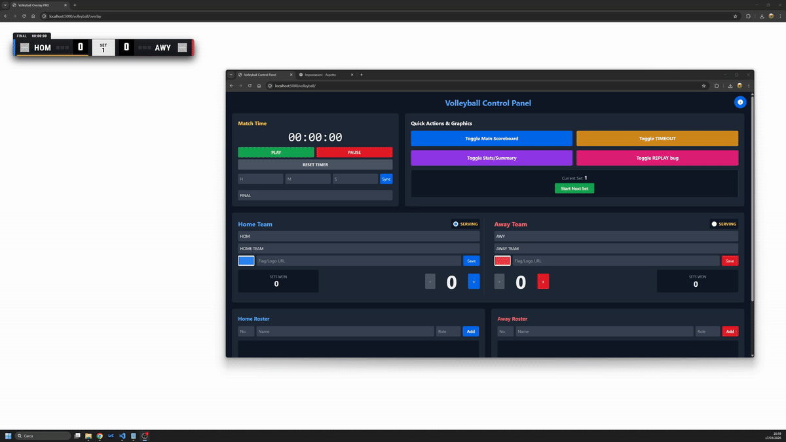

# 🎥 Live Sports Scorebug & Overlay System for OBS


🚀 **Professional live sports overlays with real-time control — directly in OBS**

This project is a web-based system designed to create and manage **scorebugs, statistics, and broadcast graphics** for live sports productions.

It works by generating **browser-based overlays** that you can directly add to OBS as *Browser Sources*, combined with a **remote control panel** to manage everything in real time.



---

## 🎯 What is this?

Think of it as your **mini broadcast graphics engine**:

- 🧮 Live **scorebug (scoreboard overlay)**
- 📊 Real-time **statistics and graphics**
- 🎬 Additional overlays (lineups, lower thirds, replays, etc.)
- 🎛️ Full **remote control panel via web browser**

No plugins, no OBS scripting — just URLs.

---

## 🧠 How it works

The system is split into two parts:

### 🖥️ Overlay (used in OBS)

- Transparent web pages
- Added to OBS as **Browser Source**
- Automatically update in real-time ⚡
- Zero interaction needed once configured

💡 **Tip (Scaling overlays in OBS)**  
If you need to **scale the overlay up or down**, you can use the CSS zoom property in the **Custom CSS settings** of the OBS Browser Source:

```css
body {
	background-color: rgba(0, 0, 0, 0);
	margin: 0px auto;
	overflow: hidden;
	zoom: 2; /* 🔍 Change this value (es. 1.5, 2, 0.8) */
}
```
---

### 🎛️ Control Panel (remote control)

- Accessible from any browser (PC, tablet, phone)
- Update scores, teams, timers ⏱️
- Trigger graphics and animations 🎬
- Designed to be simple and fast during live events

---

## 🎥 Workflow

1. Start the app
2. Open the Control Panel
3. Add overlay URLs to OBS
4. Control everything live from the panel

👉 That’s it — no refresh, everything syncs instantly.

---

## ✨ Features

- ⚡ Real-time updates (Socket.IO)
- 🖥️ OBS Browser Source ready
- 🎮 Super simple UI for live usage
- 🧩 Modular (each sport is independent)
- 🌐 Remote control from any device
- 🔌 Lightweight and fast

---

## 🚀 Quick Start

### 1️⃣ Install dependencies
```bash
pip install -r requirements.txt
```

### 2️⃣ Run the app
```bash
python run.py
```

### 3️⃣ Open browser
👉 http://127.0.0.1:5000

---

## 🔗 Example Setup

### ⚽ Soccer

- 🎛️ Control Panel  
  `/soccer`

- 🖥️ OBS Overlays  
  `/soccer/overlay` → Scorebug  
  `/soccer/stats` → Stats  
  `/soccer/lineup` → Lineups  

---

## 🧩 Project Structure

```
run.py
app/
 ├── __init__.py
 ├── routes.py
 ├── templates/
 ├── soccer/
 ├── tennis/
 └── volleyball/
```

Each sport is a standalone module → easy to expand.

---

## ➕ Add a New Sport

1. Create folder `app/new_sport`
2. Add:
   - `__init__.py` (Blueprint)
   - `routes.py`
3. Create templates (overlay + controller)
4. Register it

---

## 🛣️ Roadmap

- [ ] 🏀 Basketball support
- [ ] 🎨 Theme system
- [ ] 🐳 Docker deployment
- [ ] 🌍 Remote access dashboard
- [ ] 📡 API integration

---

## 💡 Use Cases

- 🎥 Live streaming (OBS)
- 🏐 Amateur sports production
- 🎮 eSports overlays
- 📺 Small broadcast setups

---

## ⭐ Support

If you like this project:

- ⭐ Star the repo
- 🍴 Fork it
- 🛠️ Contribute

---

## ❤️ Contributing

Pull requests are welcome!
